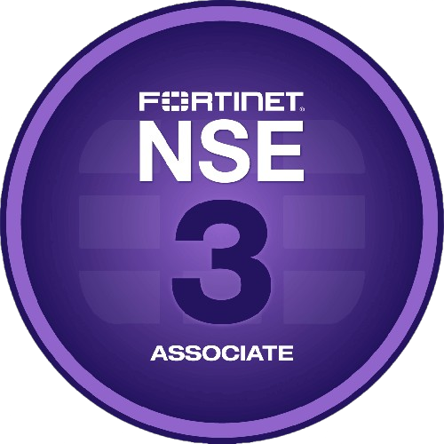

<h2 align="center"> 👋 Hi, I'm <b>Hamza Khattak </b> </h2>

  
  
  
   
  
  

A journey through code, vulnerabilities, and security, driven by curiosity and the excitement of CTFs.

  
  
  
   

<ul>
  <li><b>🌍 Website: </b> <a href="https://mhamzakhattak.vercel.app/">https://mhamzakhattak.vercel.app/</a></li>
   <li><b>📩 Email:</b> <a href="mailto:mhamzakhattak@protonmail.com">mhamzakhattak@proton.me</a></li>
  <li><b>🚀 Discord: </b> <a href="#" target="_blank">kh4tt4k</a></li>
  <li><b>👨🏻‍💻 HackTheBox: </b> <a href="https://app.hackthebox.com/profile/915532">mhamzakhattak</a></li>
  <li><b>💬 Twitter: </b> <a href="https://twitter.com/mhamxakhattak" target="_blank">mhamxakhattak</a></li>
  <li><b>📈 Linkedin: </b> <a href="https://www.linkedin.com/in/mhamzakhattak" target="_blank">mhamzakhattak</a></li>
</ul>

<h2 align="center">My Github Stats</h2> 

   
  

